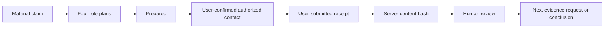

# LRWA Evidence-Operations Methodology

This note describes the behavior implemented in the current prototype. It does
not describe a completed investigation, a calibrated financial model, or a
production compliance system.

## Core rule

> A plan is not an action. An action is not a receipt. A receipt is not a
> conclusion.

LRWA preserves those distinctions in both the API and the interface.

## Workflow



The four role routes are:

- buyer: tests the practical purchase, availability, delivery, and after-sales
  path;
- supplier: tests capacity, replenishment, coverage, and operating constraints
  through a real business identity where required;
- peer or competitor: applies one visible comparison method to target and
  comparable businesses;
- skeptic: turns alternative explanations into new evidence requests.

Role labels, perspectives, and safety boundaries are fixed by the server.

## State transitions

Each mission starts as `planned`.

1. `planned → prepared`
   - requires `userConfirmedCopy: true`;
   - means the user prepared or copied the strategy;
   - does not mean an external message was sent.
2. `prepared → contacted`
   - requires `userConfirmedExternalSend: true`;
   - requires the user to name the actual authorized channel;
   - records the user's attestation that a real, authorized channel was used;
   - the current server does not send the message or verify provider delivery.
3. `contacted → evidence_received`
   - requires a user-confirmed receipt payload;
   - the server stores the payload and its content hash;
   - the current server does not verify the source provider.

`simulation_lab` investigations cannot record real contact or write into the
real receipt ledger.

## Receipt record

The current receipt payload contains:

- role identifier;
- user-entered source label;
- optional source URL;
- captured text;
- stance: `supports`, `contradicts`, or `context`;
- capture timestamp supplied by the user;
- server recording timestamp;
- authorization label `user_confirmed`;
- SHA-256 content hash.

The hash input is the JSON serialization of:

```json
{
  "roleId": "...",
  "sourceLabel": "...",
  "sourceUrl": "...",
  "capturedText": "...",
  "stance": "...",
  "capturedAt": "..."
}
```

The stored value is `sha256:` followed by the lowercase hexadecimal digest.

The hash establishes content identity relative to this exact serialization. It
does not establish authenticity, authorship, delivery, capture time, legal
admissibility, or physical observation. A future provider webhook or licensed
connector would need its own verification metadata.

An exact retry of a receipt ID is idempotent. Reusing that ID with different
content is rejected instead of silently preserving or replacing either
version.

Investigation creation also requires a client-generated UUID idempotency key.
An exact retry returns the same investigation; reusing the key for different
input is rejected. This prevents a lost response from causing a second model
operation or duplicate draft.

## DeepSeek boundary

DeepSeek is optional per investigation. When the user opts in, the backend may
request strict JSON containing, for each selected role:

- objective;
- opening question;
- follow-up;
- requested receipt.

The response is validated against a strict schema, the exact requested role
set, and deterministic known-pattern checks. A role mismatch or text that
matches the identity, deception, fabricated-action, metric, or conclusion
patterns is discarded and the response provenance becomes
`DETERMINISTIC_FALLBACK`. Pattern matching is not a complete semantic safety
classifier, so every accepted draft still requires human review. Regardless of
draft text, the model has no state-changing authority: it cannot:

- change server-owned role identity or safety boundaries;
- mark a mission prepared or contacted;
- create a receipt;
- generate an operating metric, financial estimate, score, or conclusion;
- claim that a real person, business, store, source, or platform was contacted;
- recommend fake identities, deceptive accounts, access-control bypass, or
  undisclosed automation.

Planning provenance is returned as:

- `LIVE`: valid JSON came from the configured model;
- `DETERMINISTIC_FALLBACK`: a model call was requested but no valid result was
  available;
- `NOT_REQUESTED`: model processing remained off.

No API key is stored in the repository or returned to the client.

## Connector boundary

Current capability reporting is explicit:

| Connector | Current state |
|---|---|
| Manual authorized channel | Available as a user action |
| Meituan partner integration | Not configured |
| Google Places integration | Not configured |

The prototype never substitutes generated connector data when a connector is
absent.

## Storage and security limitations

The current server uses a process-local in-memory map:

- data disappears when the process restarts;
- stale investigations are pruned by a configurable prototype TTL;
- process-level investigation and per-investigation receipt limits bound memory
  growth but do not replace authentication or rate limiting;
- there is no authentication or tenant isolation;
- there is no encrypted durable database;
- there is no immutable event log;
- there is no provider delivery webhook;
- there is no compliance-grade approval or audit signature.

The capability endpoint and frontend disclose these limitations.

Live DeepSeek calls are disabled by default even if a key exists. Enabling them
requires an explicit process flag and remains subject to a small per-process
call budget. The public frontend demo does not require a live model or a public
backend.

## What the prototype intentionally does not compute

Without submitted evidence, the system does not produce:

- store or location counts;
- sales, revenue, GMV, profit, or valuation estimates;
- confidence, fraud, or risk scores;
- customer or investigation counts;
- supported or unsupported verdicts.

Instead, the evidence ledger remains empty and the conclusion gate remains
locked.

## Production path

Before live diligence use, the product would need:

- authenticated organizations and role-based access;
- encrypted durable storage and retention policy;
- versioned strategy and receipt schemas;
- licensed or customer-authorized connectors;
- provider-backed delivery and receipt verification where possible;
- source-dependence and sampling-bias controls;
- human approval policies;
- legal, privacy, platform, and sector-specific review.

Those items are roadmap targets, not current capabilities.
